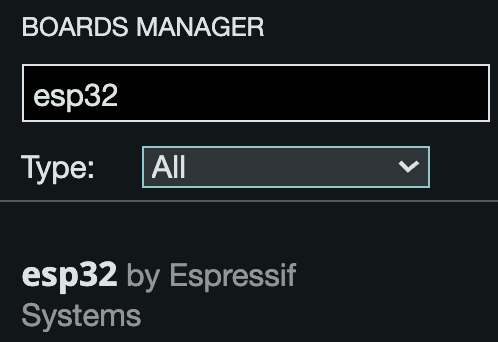
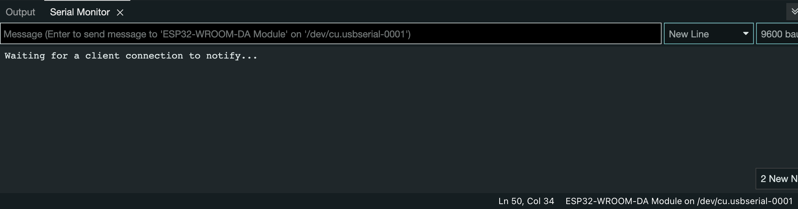
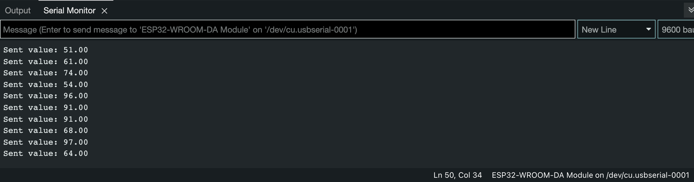

# Watch - ESP32

## Architettura del progetto
Il progetto ha come obbiettivo di fare una prototipo per un sistema di safety del driver, monitorando alcuni parametri caratteristici, svolgendo una prima anomaly detection su questi dati e inviando i relativi alert a un sistema che li rende disponibili tramite REST API e in maniera grafica tramite delle dashboard.
Le componenti usate sono:
- OBD server: utilizzando un simulatore di dati OBD-II, fornisce al gateway i relativi dati usando il BLE e la comunicazione tramite Web Socket (per motivi di testing). Il componente è disponibile al seguente [link](https://github.com/UniSalento-IDALab-IoTCourse-2022-2023/wot-project-2022-2023-OBDsimulator-Culcea_Merico)
- Watch: simulato tramite una board ESP32 che fornisce il valore del battito tramite BLE. Il componente è disponibile al seguente [link](https://github.com/UniSalento-IDALab-IoTCourse-2022-2023/culcea-merico__driver_safety_watch).
- Gateway: applicazione Android che prende i dati collegandosi all'OBD server e al Watch, svolge una anomaly detection prototipale usando dei valori di soglia per il battito cardiaco e l'accelerazione. Gli alert generati sono inviati tramite rete mobile al backend. Il componente è disponibile al seguente [link](https://github.com/UniSalento-IDALab-IoTCourse-2022-2023/culcea-merico__driver_safety_gateway).
- Backend: server che salva i dati di alert inviati del gateway, fornisce una REST API per poterne fare uso e permette di visualizzare una dashboard real-time dei dati aggregati. Il componente è disponibile al seguente [link](https://github.com/UniSalento-IDALab-IoTCourse-2022-2023/wot-project-2022-2023-Dashboard-Cloud-Culcea_Merico).


## Esecuzione
Eseguire:
- Configurare Arduino IDE per lavorare con l'ESP32. 
- Script per generare i dati e inviarli tramite bluetooth.
- Gateway con applicazione android che legge questi dati.

### Configurare Arduino IDE
La board ESP32 non è utilizzabile di default su Arduino IDE. Per aggiungerla seguire i passi della seguente [guida](https://dronebotworkshop.com/esp32-intro/), ovvero:
- Inserire `https://raw.githubusercontent.com/espressif/arduino-esp32/gh-pages/package_esp32_index.json` all'interno del campo "Additional board managers URLs" nelle preferenze di Arduino Studio.
- Aprire il Board Manager (si trova aprendo "Tools" poi "Board"), nel campo di ricerca scrivere "esp32" per poi installare "esp32 by Espressif System".


### Script ESP32
Utilizzando Arduino IDE, aprire il file. Collegare il device alla porta USB del computer, selezionare la board corretta (menù "Tools" poi "Board") e la porta corretta (menù "Tools" poi "port") e fare l'upload del codice (menù "Sketch" e poi "Upload"). Dopo la compilazione e il caricamento, sulla serial board comparirà:


### Eseguire il gateway
Avviare il gateway come specificato nel README del relativo progetto.
Dopo l'avvio, la board si collega all'ESP32 e invierà i dati del battito cardiaco tramite BLE.


## Spiegazione codice

Nella prima sezione del file sono importate le librerie utilizzate e definite delle macro per gli uuid del servizio e la caratteristica del battito cardiaco; l'ESP32 svolge il ruolo di GATT server. Sono inoltre definite le variabili globali.
```c++
#include<BLEDevice.h>
#include<BLEServer.h>
#include<BLEUtils.h>
#include<BLE2902.h>

BLECharacteristic *pCharacteristic;
bool deviceConnected = false;
int txValue = 0;

#define SERVICE_UUID "6E400001-B5A3-F393-E0A9-E50E24DCCA9E"
#define CHARACTERISTIC_UUID_TX "6F400003-B5A3-F393-E0A9-E50F24DCCA9F"
```

Nella successiva sezione è definita una classe per codificare il comportamento del server quando avviene una connessione (la variabile globale per indicare se c'è o meno un device connesso è settata a true) e quando avviene una disconnessione (la variabile globale per indicare se c'è o meno un device connesso è settata a false e riparte l'advertising per essere scoperti e ricevere una nuova connessione).
```c++
class MyServerCallbacks: public BLEServerCallbacks {
  void onConnect (BLEServer* pServer) {
    deviceConnected = true;
  };
  void onDisconnect (BLEServer* pServer) {
    deviceConnected = false;
    pServer->getAdvertising()->start();
  }
};
```

Nel setup viene inizializzato il device, creato il server associando un'istanza della classe definita prima. Viene inizializzato il servizio e la caratteristica e inizia l'advertising in attesa che un client si colleghi.
```c++
void setup() {
  Serial.begin(9600);
  BLEDevice::init("ESP32");
  BLEServer *pServer = BLEDevice::createServer();
  pServer->setCallbacks(new MyServerCallbacks());

  BLEService *pService = pServer->createService(SERVICE_UUID);

  pCharacteristic = pService->createCharacteristic(CHARACTERISTIC_UUID_TX, BLECharacteristic::PROPERTY_NOTIFY); //BLE2902 needed to notify
  pCharacteristic->addDescriptor(new BLE2902());

  pService->start();
  // Start advertising
  pServer->getAdvertising()->start();
  Serial.println("Waiting for a client connection to notify...");
}
```

Nel loop si invia il valore se c'è una connessione con un client. Il valore viene generato casualmente, convertito in stringa, inserito come valore della caratteristica e avviene la notifica per la stessa, in maniera tale che il client possa leggere il nuovo valore.
```c++
void loop() {
  if (deviceConnected) {
    txValue = (int) random(50, 100); // Conversion of txValue
    char txString[8];
    dtostrf(txValue, 1, 2, txString);

    pCharacteristic->setValue(txString);
  // Notifying the connected client
    pCharacteristic->notify();
    Serial.println("Sent value: " + String (txString));
    delay(500);
  }
}
```
